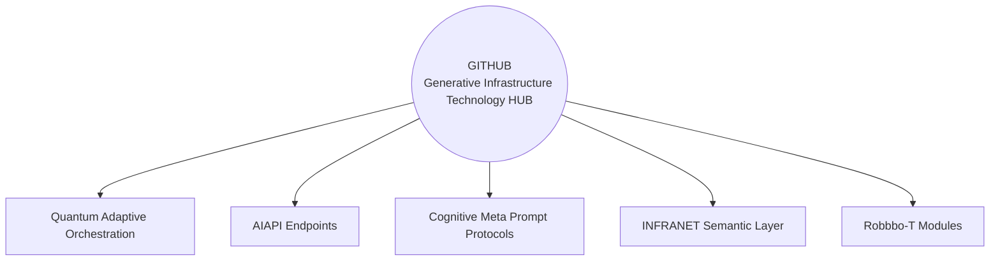

# GITHUB
Robbbo-T Tactical Division – GAIA AIR Astrionic Systems Powered by Generative Ethics, Federated Logic, and Quantum Insight.
---

⸻# GITHUB — Generative Infrastructure Technology HUB

### Redefining GITHUB as the Tactical Core for Generative Deployment and Collaboration

> **“From versioning code to versioning infrastructure — semantically, ethically, and tactically.”**

---

## Overview

**GITHUB**, reimagined as **Generative Infrastructure Technology HUB**, serves as the operational and collaborative backbone for Robbbo-T modules and federated AI systems like **GAIA AIR**. It moves beyond conventional code hosting and versioning — acting instead as a semantic deployment interface for intelligent, explainable, and sovereign infrastructure.

---

## Core Pillars

### 1. **Generative**
- Supports AI/LLM-generated code, configurations, and orchestration flows.
- Enables creation of digital twins, deployment manifests, and self-evolving scripts.

### 2. **Infrastructure**
- Connects to edge systems, smart robotics (e.g., Robbbo-T), and orbital environments.
- Integrates with **INFRANET**, enabling real-time traceability, telemetry, and ethics validation.

### 3. **Technology**
- Bridges the gap between classical DevOps and autonomous ops (AIOps).
- Incorporates **MPP-C-COAFI**, **QAO**, and **AIAPI** endpoints for cognitive control.

### 4. **HUB**
- A living, federated hub where modules, blueprints, and agents coexist.
- Semantic versioning, tactical documentation, and operational integrity all in one place.

---

## Integration with GAIA AIR

⸻

Licensing & Ethic-Aware Governance

All content is governed under the GAIA AIR Ethical License, enforcing:

Transparent AI behavior

Bias-detection and correction mandates

Real-time auditability of actions and decisions

   
